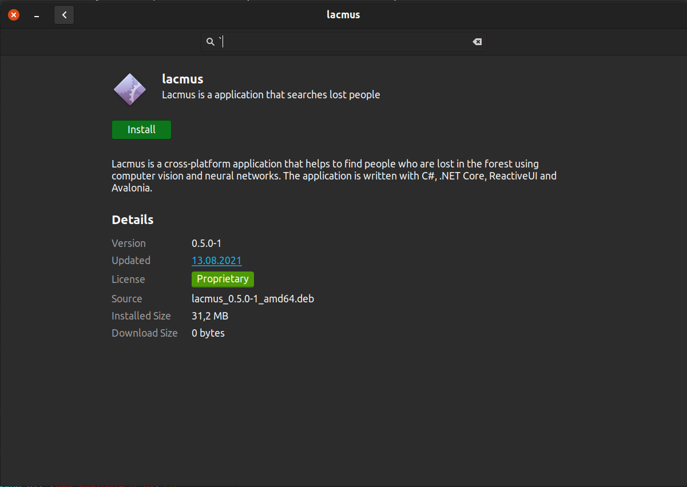
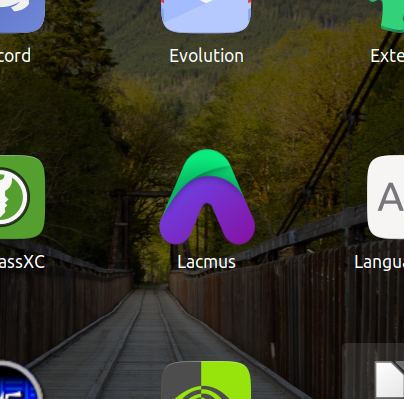
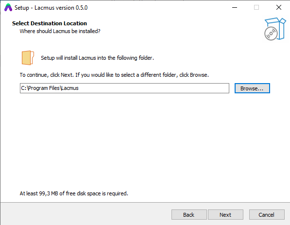

# 🚀 Установка


Приложение Lacmus является кросс-платформенным и доступен для ос Windows, Linux, OSX



Данная инструкция справедлива для версий LacmusApp **1.x.x** и новее.&#x20;

Версии 0.5.x и более ранние считаются устаревшими и больше _не поддерживаются_.

Версии 0.6.x - 0.9.x совместимы с версиями 1.x.x, но могут иметь некоторые незначитаельые отличия в интерфейсе.&#x20;

Пожалуйста, убедитесь, что вы используете последнюю версию программы.&#x20;


## Linux

### Debian / Ubuntu

1. Перейдите [ссылке](https://github.com/lacmus-foundation/lacmus-app/releases), выбрав последнюю стабильную версию программы.
2. Во вкладке `Assets` выберите deb пакет `LacmusApp.Avalonia.X.X.X.linux-x64.deb` и загрузите его.
3. Установите пакет любым из способов:
   * щелкнув по нему 2 раза и нажав установить (рис. 1)
   *   выполнив команду:

       ```
       $ sudo apt install ./LacmusApp.Avalonia.X.X.X.linux-x64.deb
       ```
4.  В списке программ найдите `Lacmus` и запустите программу (рис. 2). \
    Программу также можно запустить из терминала, выполнив команду:

    ```
    $ lacmus
    ```





### Fedra

1. Перейдите [ссылке](https://github.com/lacmus-foundation/lacmus-app/releases), выбрав последнюю стабильную версию программы.
2. Во вкладке `Assets` выберите deb пакет `LacmusApp.Avalonia.X.X.X.linux-x64.rpm` и загрузите его.
3. Установите пакет любым из способов:
   * щелкнув по нему 2 раза и нажав установить (рис. 1)
   *   выполнив команду:

       ```
       $ sudo dnf install ./LacmusApp.Avalonia.X.X.X.linux-x64.rpm
       ```
4.  В списке программ найдите `Lacmus` и запустите программу (рис. 2). \
    Программу также можно запустить из терминала, выполнив команду:

    ```
    $ LacmusApp.Avalonia
    ```

### Другие дистрибутивы (ручная установка)

1. Перейдите [ссылке](https://github.com/lacmus-foundation/lacmus-app/releases), выбрав последнюю стабильную версию программы.
2. Во вкладке `Assets` выберите архив пакет `LacmusApp.Avalonia.X.X.X.linux-x64.tar.gz` и загрузите его.
3. Распокуйте архив в удбное место, например `~/Documents` (В таком случае полный путь до приложения будет `~/Documents/LacmusApp.Avalonia.X.X.X`)
4.  В терминале выполните команду

    ```
    $ chmod +x ~/Documents/LacmusApp.Avalonia.X.X.X/LacmusApp.Avalonia
    $ ~/Documents/lacmus/LacmusApp
    ```

* Опционально вы можете создать ссылку на программу:

```
$ sudo ln -s ~/Documents/LacmusApp.Avalonia.X.X.X/LacmusApp.Avalonia /usr/bin/LacmusApp.Avalonia
```

* Вы также можете создать ярлык в меню приложений используя команду:

```
$ cat <<EOF > lacmus.desktop
[Desktop Entry]
Version=X.X.X
Name=Lacmus
StartupWMClass=Lacmus
Comment=Lacmus Desktop Application
GenericName=Program for searching and saving people
Name[ru]=Lacmus
GenericName[ru]=Приложение Lacmus
Comment[ru]=Программа для поиска и спасения людей
Exec=/usr/bin/LacmusApp.Avalonia
Icon=/usr/share/pixmaps/lacmus.png
Terminal=true
Type=Application
Categories=ImageProcessing;Photography;Utility;
MimeType=image/jpeg;image/png;image/xml;image/bmp;text/xml;
EOF

$ sudo mv lacmus.png /usr/share/pixmaps/lacmus.png
$ sudo mv lacmus.desktop /usr/share/applications/lacmus.desktop
```


lacmus.png


## Windows

1. Перейдите [ссылке](https://github.com/lacmus-foundation/lacmus-app/releases), выбрав последнюю стабильную версию программы.
2. Во вкладке `Assets` выберите EXE файл `LacmusApp.Avalonia.X.X.X.win-x64.setup.exe` и загрузите его.
3. Установите программу, следуя инструкциям установщика. (Рис. 3)
4. В списке программ найдите `Lacmus` и запустите программу.



### Ручная установка

При желании приложение можно установить вручную. Для этого:

1. Перейдите [ссылке](https://github.com/lacmus-foundation/lacmus-app/releases), выбрав последнюю стабильную версию программы.
2. Во вкладке `Assets` выберите архив `LacmusApp.Avalonia.X.X.X.win-x64.zip` и загрузите его
3. Распакуйте рхив в удобное место (например `C:\Users\%USER%\Documents\lacmus-X.X.X`)
4. Зайдите в дирикторию с приложением (`C:\Users\%USER%\Documents\lacmus-X.X.X`)
5.  Выполните `LacmusApp.Avalonia.exe` кликнув 2 раза по файлу, или вызвав его из командной строки:

    ```
    > LacmusApp.Avalonia.exe
    ```

При жилании на приложение можно созать ярлык на рабочем столе.

## OSX


На последних версиях OSX при запуске приложения может возникнуть предупреждение о том что разработчик не зарегистрирован. В таком случае разрешите запуск ПО Lacmus в настройках безопасности системы.


1. Перейдите [ссылке](https://github.com/lacmus-foundation/lacmus-app/releases), выбрав последнюю стабильную версию программы.
2. Во вкладке `Assets` выберите архив `LacmusApp.Avalonia.X.X.X.osx-x64.application.zip` и загрузите его.
3. Распакуйте архив, установите приложение (LacmusApp.app).
4. В списке программ найдите `Lacmus` и запустите программу.

### Ручная установка

При желании приложение можно установить вручную. Для этого:

1. Перейдите [ссылке](https://github.com/lacmus-foundation/lacmus-app/releases), выбрав последнюю стабильную версию программы.
2. Во вкладке `Assets` выберите архив`LacmusApp.Avalonia.X.X.X.osx-x64.tar.gz` и загрузите его.
3. Распаковать в удобное место (например `~/lacmus-X.X.X`)
4.  В терминале выполнить:

    ```
    cd ~/lacmus-X.X.X
    ./LacmusApp.Avalonia
    ```
