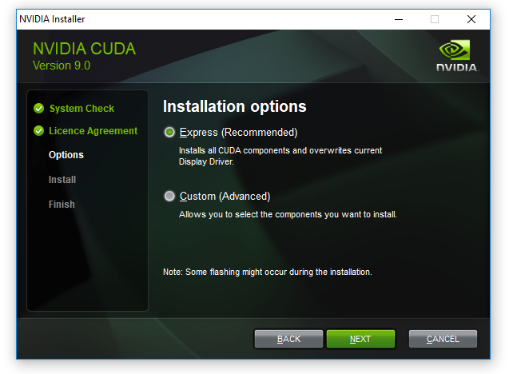
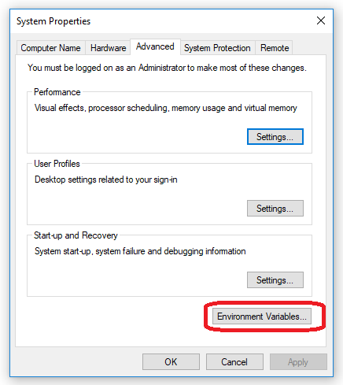
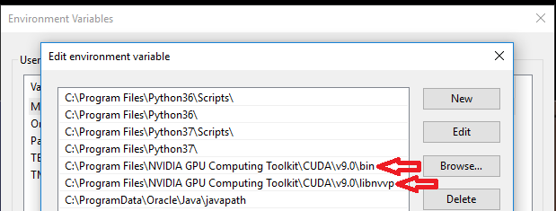

# 🤿 Установка зависимостей ML моделей


Ниже приведены инструкции установки драйверов и библиотек для актуальной **Lacmus YOLO v5 2.2.0**. Для других ML моделей версии зависимостей могут отличаться. \
Полный список зависимостей и их версий вы всегда можете посмотреть в информации о модели окне приложения.



Для коррмекной работы ML моделей вам необходим CPU с поддержкой **AVX**. Больше подробностей можно узнать в разделе [системные требования](../system-requirements/).


О разновидностях ML моделей и их зависимостях вы можете прочитать тут:


[model-zoo.md](../system-requirements/model-zoo.md)


## CPU модели

### Windows

Загрузите [Microsoft Visual C++ 2019 Redistributable (x64)](https://aka.ms/vs/17/release/vc\_redist.x64.exe).

Установите, следуя инструкциям установщика.

## CudaGPU модели


В данной инструкции рассматривается вариант установки CUDA == 11.6, CuDNN == 8.5.0.96



Инструкция предполагает что вы обладаете GPU от nVidia, а на вашей ОС установлен проприетарный nVidia драйвер.


### Linux

Выполните коменду в терминале `nvidia-smi`:

```
Sun Aug 15 15:22:37 2021       
+-----------------------------------------------------------------------------+
| NVIDIA-SMI 470.57.02    Driver Version: 470.57.02    CUDA Version: 11.4     |
|-------------------------------+----------------------+----------------------+
| GPU  Name        Persistence-M| Bus-Id        Disp.A | Volatile Uncorr. ECC |
| Fan  Temp  Perf  Pwr:Usage/Cap|         Memory-Usage | GPU-Util  Compute M. |
|                               |                      |               MIG M. |
|===============================+======================+======================|
|   0  Quadro T1000       Off   | 00000000:01:00.0 Off |                  N/A |
| N/A   42C    P8     3W /  N/A |    296MiB /  3911MiB |      1%      Default |
|                               |                      |                  N/A |
+-------------------------------+----------------------+----------------------+
```


Обратите внимание на запись **CUDA Version: 11.4**. Если ваша версия равняется необходимой то этот шаг вы можете пропустить.


В терминале выполните:

```
$ sudo apt update
$ wget -O /tmp/cuda_11.6.0_510.39.01_linux.run https://developer.download.nvidia.com/compute/cuda/11.6.0/local_installers/cuda_11.6.0_510.39.01_linux.run
$ sudo sh /tmp/cuda_11.6.0_510.39.01_linux.run
```

Перезагрузите компьютер

Также может быть полезна [официальная документация](https://docs.nvidia.com/cuda/cuda-installation-guide-linux/index.html) и [официальная страница загрузки](https://developer.nvidia.com/cuda-11-6-0-download-archive).

### Windows

Загрузите [Microsoft Visual C++ 2019 Redistributable (x64)](https://aka.ms/vs/17/release/vc\_redist.x64.exe).

Установите, следуя инструкциям установщика.

Загрузие [CUDA установщик с официальной страницы](https://developer.nvidia.com/cuda-11-6-0-download-archive?target\_os=Windows\&target\_arch=x86\_64), выбрав версию ОС (windows 10 или 11)

Запустите **cuda\_XXX.exe** и установите, следуя инструкциям установщика (при выборе режима - выбирите Exxpress).



Во время установки, запомните **путь-установки-CUDA** (по умолчанию `C:\Program Files\NVIDA GPU Computing Toolkit\CUDA\v11.6`)

Откройте _Панель у правления->Система и безопасность->Систма->Дополнительные параметры системы (Control Panel_ ->_System and Security_->_System_->_Advanced System settings)_ и выберете пункт _Переменные окружения (Environment Variables)._



Выбирете переменную PATH, и нажмите _Редактировать (Edit)_. Добавте туда строчки:

* **путь-установки-CUDA\bin**
* **путь-установки-CUDA\libnvvp**




Перезагрузите компьютер

Также может быть полезна [официальная документация](https://docs.nvidia.com/cuda/cuda-installation-guide-microsoft-windows/index.html).

## AnyGPU модели (Direct.ML)

### Windows

Загрузите [Microsoft Visual C++ 2019 Redistributable (x64)](https://aka.ms/vs/17/release/vc\_redist.x64.exe).

Установите, следуя инструкциям установщика.
