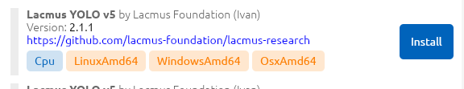

# 💥 Quick Start

The [Lacmus](https://github.com/lacmus-foundation/lacmus-app) cross-platform application was specifically designed to assist search and rescue teams in locating missing individuals by utilizing the power of the [Lacmus neural network](https://github.com/lacmus-foundation/lacmus). Its intuitive graphical user interface allows users to easily process images captured from unmanned aerial vehicles (UAVs), and effectively search for people within said images using neural network algorithms. This software is a valuable tool for search and rescue operations and has the potential to save countless lives. It is compatible with various operating systems including Linux, Windows, and Mac OS X. The application was developed utilizing the programming languages C#, .NET Core, [ReactiveUl](https://github.com/reactiveui/ReactiveUI), and [Avalonia](https://github.com/AvaloniaUI/Avalonia).

<figure><figcaption>
main view
</figcaption></figure>

### Step 1: Install 💻


The present article furnishes fundamental guidelines for commencing the utilization of Lacmus. The focus of this discourse is solely limited to the rudimentary facets of program usage and installation. A thorough understanding of the software requires an in-depth review of the corresponding sections outlined in the relevant sections of the documentation.



This instruction is valid for LacmusApp versions **0.6.x** and newer. Versions 0.5.x and earlier are no longer supported.


Initially, it is recommended that you review the system requirements:

Follow these steps depending on your operating system:

**Linux (Debian / Ubuntu)**

1. Download the [latest version of Lacmus App](https://github.com/lacmus-foundation/lacmus-app/releases).
2. Open `Assets` section, select the deb package `LacmusApp.Avalonia.X.X.X.linux-x64.deb` , and download it (_X.X.X is the program version_).
3. Install the package in any of the following ways:
   1. Double-click on it and press the **install** button
   2. Run the following command:\
      `sudo apt install ./LacmusApp.Avalonia.X.X.X.linux-x64.deb`
4. In the list of programs, find Lacmus and run the program.

#### Windows

1. Download the [latest version of Lacmus App](https://github.com/lacmus-foundation/lacmus-app/releases).
2. Open `Assets` section, select the EXE file `LacmusApp.Avalonia.X.X.X.win-x64.setup.exe` , and download it (_X.X.X is the program version_).
3. Install the program following the instructions of the installer.
4. In the list of programs, find Lacmus and run the program.

#### OSX


In the latest versions of the OSX operating system, it is probable that upon launching the Lacmus application, a notification might be displayed indicating that the developer is unregistered. In such an instance, it is imperative that the Lacmus software is granted permission to execute within the system security settings.


1. Download the [latest version of Lacmus App](https://github.com/lacmus-foundation/lacmus-app/releases).
2. Open `Assets` section, select the archive `LacmusApp.Avalonia.X.X.X.osx-x64.application.zip` , and download it (_X.X.X is the program version_).
3. Extract the archive and install the application.
4. In the list of programs, find Lacmus and run the program.

More detailed instructions are given in the section:

### Step 2: Configure 🔧

1. Open the application settings (go to `File -> Settings`);
2. Set up the general settings (General tab):
   1. Select the language;
   2. Select UI Theme;
3. Configure ML model:
   1. Choose the `Available models` tab;
   2.  Choose a suitable model from the list (choose the type according to your hardware). E.g. `Lacmus YOLO v5 Cpu`;

       <figure><figcaption></figcaption></figure>
   3. Click the `Install` button and wait for the download to complete;
   4. Go to the `Installed models` tab;
   5. Select the desired model from the list and press `Activate`;
   6. Don't forget to click the `Apply` button to _apply the settings._

### Step 3: Run detection! 🎯

1. Run the recognition wizard by selecting the menu `File -> Wizard`;
2. The welcome window will open in front of you. Click `Next` to continue;
3. Select a folder with photos to recognize by clicking the `Select Photo` button. After selecting a folder, click `Next`;
4. Choose a folder to save. Upon completion, the program will save the results in this folder. After selecting a folder, click `Next`;
5. Make sure that the ML model is ready and click `Start Processing`;
6. The program will process the data using the AI and will save the results. Wait until the end of the process.
7. Click `Finish` button to view the results in the main window or `Repeat` to process other data.

1.
