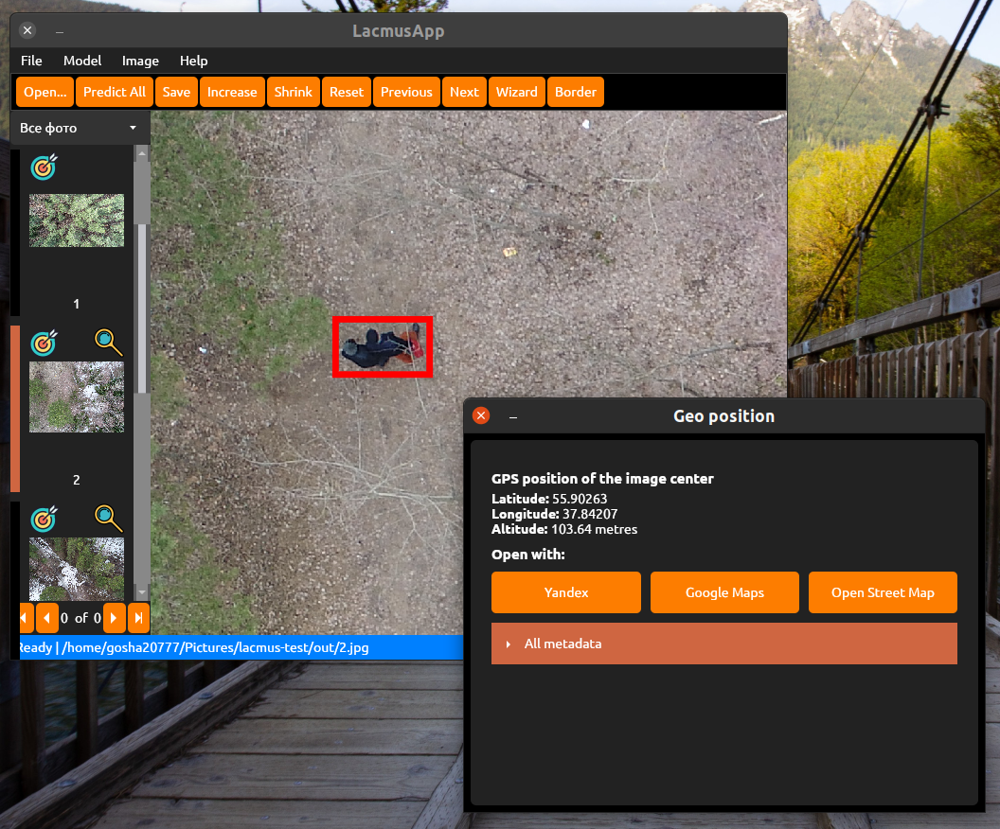
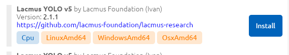

# 💥 Быстрый Старт

[Приложение Lacmus](https://github.com/lacmus-foundation/lacmus-app) - кросс-платформенная программа с графическим интерфейсом позволяющая запускать [нейронную сеть ](https://github.com/lacmus-foundation/lacmus)[Lacmus](https://github.com/lacmus-foundation/lacmus) на перональных компьютерах. Приложение позволяет пользователю просматривать и обрабатывать фотографии полученные с БПЛА, осуществлять поиск людей на фотографиях с помошью нейронных сетей. По работает на ОС Linux, Windows и Mac OS X. Приложение разработано с использованием C#, .NET Core, [ReactiveUI](https://github.com/reactiveui/ReactiveUI) и [Avalonia](https://github.com/AvaloniaUI/Avalonia).



### Шаг 1: Установка приложения 💻


В этой статье приведена базовая инструкция которая поможет вам начать пользоваться Lacmus. Тут приведены и рассмотрены лишь базовые аспекты использования и установки программы. Для более детального изучения ознакомитесь с соответствующими разделами документации.



Данная инструкция справедлива для версий LacmusApp 1.x.x и новее.&#x20;

Версии 0.5.x и более ранние считаются устаревшими и больше _не поддерживаются_.

Версии 0.6.x - 0.9.x совместимы с версиями 1.x.x, но могут иметь некоторые незначитаельые отличия в интерфейсе. Пожалуйста, убедитесь, что вы используете последнюю версию программы.&#x20;


Для начала ознакомтесь с системными требованиями:


[system-requirements](system-requirements/)


В зависимости от вашей операционной системы выполните следующие действия:

#### Для Linux (debian / ubuntu)


Установка для других дистпибутивов описана в соответствующем [разделе](install/)


1. Перейдите [ссылке](https://github.com/lacmus-foundation/lacmus-app/releases), выбрав последнюю стабильную версию программы.
2. Во вкладке `Assets` выберите deb пакет `LacmusApp.Avalonia.X.X.X.linux-x64.deb` и загрузите его (_где X.X.X - версия программы_).
3. Установите пакет любым из способов:
   * щелкнув по нему 2 раза и нажав **установить**
   *   выполнив команду:

       ```
       $ sudo dpkg -i LacmusApp.Avalonia.X.X.X.linux-x64.deb
       ```
4. В списке программ найдите `Lacmus` и запустите программу.

#### Для Windows

1. Перейдите [ссылке](https://github.com/lacmus-foundation/lacmus-app/releases), выбрав последнюю стабильную версию программы.
2. Во вкладке `Assets` выберите EXE файл `LacmusApp.Avalonia.X.X.X.win-x64.setup.exe` и загрузите его.
3. Установите программу, следуя инструкциям установщика.
4. В списке программ найдите `Lacmus` и запустите программу.

#### Для OSX


На последних версиях OSX при запуске приложения может возникнуть предупреждение о том что разработчик не зарегистрирован. В таком случае разрешите запуск ПО Lacmus в настройках безопасности системы.


1. Перейдите [ссылке](https://github.com/lacmus-foundation/lacmus-app/releases), выбрав последнюю стабильную версию программы.
2. Во вкладке `Assets` выберите архив `LacmusApp.Avalonia.X.X.X.osx-x64.application.zip` и загрузите его.
3. Распакуйте архив, установите приложение (LacmusApp.app).
4. В списке программ найдите `Lacmus` и запустите программу.

Более подробная инструкция приведена в разделе:


[install](install/)


### Шаг 2: Настройка приложения 🔧


Подробнее о версиях ML моделей, их типах вы можете посмотреть [тут](system-requirements/model-zoo.md). В зависимости от выбранного [типа выполнения](system-requirements/model-zoo.md#tipy-vypolneniya) и [версии](system-requirements/model-zoo.md#versii-ml-modelei) ML модели возможно потребуется установка дополнительеых [зависимостей](system-requirements/model-zoo.md#zavisimosti-ml-modelei).



Процесс установки драйверов необходимых для работы CUDA моделей описан [тут](install/)



ML модель может занимать от 100 Мб на жестком диске, а ее загрузка и установка может занять некоторое время. Убедитесь что ваше интернет-соединение стабильно(!).


1. Откройте настройки приложения выбрав пункт меню `Файл (File)` -> `Настройки (Settings)`
2. **Настройте общие настройки (вкладка Общее \[General])**:
   * Выберите язык приложения (language)
   * Выберите подходящую вам тему оформления
3. **Настройте ML модель**:
   1. Откройте вкладку `Доступные модели (Available models)`.
   2. Выберите модель из списка с желаемым [типом](system-requirements/model-zoo.md#tipy-vypolneniya), например`Lacmus YOLO v5 Cpu`:\
      
   3. Нажмите кнопку `Установить (Install)` и дождитесь окончания загрузки.
   4. Откройте вкладку `Установленные модели (Installed models)`.
   5. Выберите нужную модель из списка и нажмите `Активировать (Activate)`.
   6. Нажмите кнопку `Применить` для _применения_ _настроек_

Смотрите также:


[model-zoo.md](system-requirements/model-zoo.md)



[dependencies.md](install/dependencies.md)


### Шаг 3: Запуск распознавания! 🎯

1. Запустите мастер распознавания фото выбрав пункт меню `Файл` -> `Помощник`.
2. Перед вами откроется окно приветствия помощника. Нажмите `Далее` для продолжения.
3. Выберете папку с фотографиями для распознавания нажав кнопку `Выбрать фото`. После выбора папки нажмите кнопку `Далее`.
4. Выберете папку для сохранения. По завершению работы программа сохранит фотографии и XML аннотации к ним в _выбранную папку_.
5. Убедитесь в готовности и правильности выбора ML модели и нажмите `Начать обработку`.
6. Программа загрузит, обработает с помощью ML модели и сохранит результаты в выбранную папку. Дождитесь окончания процесса.
   * Нажав кнопку `Завершить` вы можете просмотреть результаты распознавания в основном окне программы.
   * Вы также можете повторить операцию с другой порцией фотографий нажав кнопку `Повторить` и просмотреть результаты позже выбрав меню `Файл` -> `Импортировать из XML`.

Смотрите также:


[ui.md](ui.md)

