# 🦄 Пользовательский Интерфейс


Данная инструкция справедлива для версий LacmusApp **1.x.x**. На других версиях пользовательский интерфейс может отличаться.


Приложение Lacmus включает в себя следующие окна:

* [Главное окно](ui.md#glavnoe-okno).
* [Помощник распознавания](ui.md#pomoshnik-raspoznovaniya).
* [Наройки](ui.md#nastroiki).
* [Параметры сохранения](ui.md#parametry-sokhraneniya).
* [Окно просмотра геопозиции](ui.md#okno-prosmotra-geopozicii).
* [Отправка сообщения об ошибке](ui.md#otpravka-soobsheniya-ob-oshibke).
* [О программе](ui.md#informaciya-o-programme).
* [Фурнал событий (лог)](ui.md#zhurnal-sobytei-log).

## Главное окно

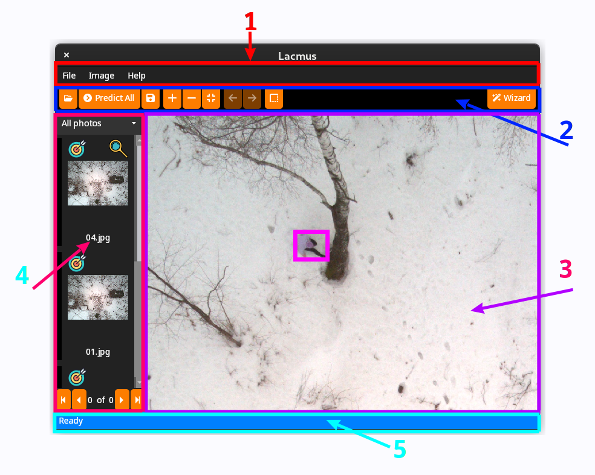

Главное окно программы состоит из стедующих элементов:

1. [Главное меню программы](ui.md#glavnoe-menyu)
2. [Панель быстрых команд](ui.md#panel-bytrykh-komand)
3. [Элемент просмотра фотографии](ui.md#prosmotorshik-fotografii)
4. [Список фотографий](ui.md#spisok-fotografii)
5. [Строка состояния](ui.md#stroka-sostoyaniya)

### Главное меню


Главное меню содержит меречень всех функций программы


Главное меню имеет следующую структуру

* _**Файл**_
  * _Открыть_ - открывает диалоговое окно для выбора попки с фотографиями.
  * _Импортировать из XML_ - открывает диалоговое окно для просмотра ранее обработанных в Lacmus фотографий. Как через приложение, так и через FTP интерфейс.
  * _Сохранить_ - сохраняет результаты распознования в выбранную папку.
  * _Сохранить как..._ - открывает окно с выбором параметров сохранения. Например можно сохранить фотографии с нарисованными рамками объектов, отфильтровать фотографии.
  * _Помощник_ - открывает окно [помощника по распознованию фото](ui.md#pomoshnik-raspoznovaniya).
  * _Настройки_ - открывает [окно настроек](ui.md#nastroiki).
  * _Показать лог_ - открыть [лог программы](ui.md#zhurnal-sobytei-log).
  * _Выход_ - выход из программы.
* _**Изображение**_
  * _Обработать все_ - запускает процесс поиска объектов.
  * _Увеличеть_ - увеличивает изображение в просмотерщике изображений.
  * _Уменьшить_ - уменьшает изображение в просмотерщике изображений.
  * _Сбросить_ - сбрасывает масштаб изображения и распологает его по центру в просмотерщике изображений.
  * _Следующее_ - открывает следующее изображение в просмотерщике.
  * _Предыдущее_ - открывает предыдущее изображение в просмотерщике.
  * _Показать\Скрыть рамку_ - показывает или скрывает рамку с объектом на озображении.
  * _Показать геопозицию_ - открывает [окно просмотра геопозиции](ui.md#undefined).
  * _Добавить\Удалить из избранных_ - добавляет или удаляет фото из избранных.
  * _Сообщить об ощибке_ - сообщить об ошибке распознования и отправить данные об ошибке на сервер.
* _**Помощь**_
  * _Открыть руководство пользователя_ - открывает документацию в обраузере.
  * _О программе_ - открывает окно сведений о программе.
  * _Проверить обновления_ - выполнить проверку обновлений.

### Панель быстрых команд


Панель быстрых команд представлена набором кнопок, ниболее встречающимеся действиями из главного меню&#x20;


* _Открыть..._ - открывает диалоговое окно для выбора попки с фотографиями.
* _Обработать все_ - запускает процесс поиска объектов.
* _Сохранить_ - сохраняет результаты распознования в выбранную папку.
* _Сбросить_ - сбрасывает масштаб изображения и распологает его по центру в просмотерщике изображений.
* _Помощник_ - открывает окно помощника по распознованию фото.
* _Рамка -_ показывает или скрывает рамку с объектом на озображении.

### Просмоторщик фотографий


Просмоторщик фотографий позволяет просмотреть выбранную фотографию из списка фотографий, изменять ее масштаб и просматривать отдельные области фотографии.


Элементы управления:

* _Правая кномка мыши_ - перемещает фотографию по просмотрщику.
* _Колесико мыши_ - изменяет масштаб.
* _Левая кнопка мыши_ - открывает контекстное меню.

#### Контекстное меню

* _Показать геопозицию_ - открывает [окно просмотра геопозиции](ui.md#undefined).
* _Добавить\Удалить из избранных_ - добавляет или удаляет фото из избранных.

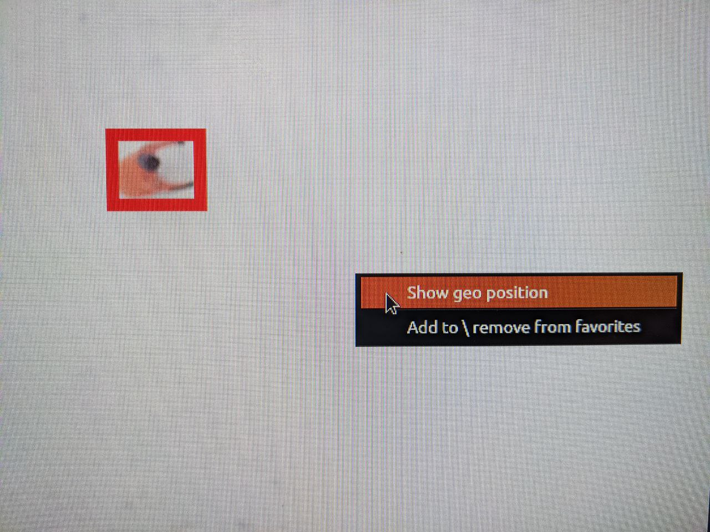

### Список фотографий


Список фотографий позволяет итерироваться между фотографиями, отслеживать статусы фотографий и сортировать фотографии.


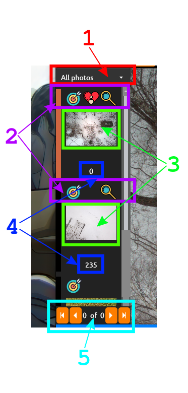

Список фотографий состоит из стедующих элементов:

1. _Фильтор_ - позволяет фильтровать фотографии по следубщим категориям:
   1. _Все фото_ - отобразить все фото (без фильтра).
   2. _Фото с объектами_ - отобразить только фото с объектами.
   3. _Избранные фото_ - отобразить только избранные фото.
2. _Индекаторы фотографий_ - индекаторы, показывающие атрибуты фотографий:\
   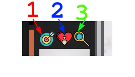
   1. :dart: - показывает есть ли объект на изображении.
   2. :heart: - показывает добавлено ли изображение в избраное.
   3. :mag: - показывает было ли просмотрено изображение.
3. _Миниатюра изображения_ - позволяет легко просматривать фотографию.
4. _Имя файла_ - показывает цифры из имени файла.\
   Например файл с названием `gosha20777.png` будет отображаться как `20777`. Полное имя файла можно вуидеть, если навести курсор мыши на изображение:\
   
5. _Переключатель страниц_ - если в списке большое колличество изображений, то изображения сортируются по страницам подобно страницам в поискавеке (Яндекс, google). Таким образом приложение потребляет меньше ресурсов.

### Строка состояния


Строка состояния отражает текущее состояние программы


Строка состояния может отражать такие статусы

* _**Reedy**_ - статус означает что программа готова к работе.
* _**Working**_ - статус означает что программа находится в процессе обработки задачи (например анализ или загрузка изображений).
* _**Error**_ - статус означает что какая-либо операция завершилась с ошибкой (например при попытке загрузки озображения возникла ошибка и т. д.).

Строка состояния имеет следующую структуру

```
Статус | дополнительная информация
```

<table><thead><tr><th width="159.83211678832114">Статус</th><th width="150">Цвет</th><th>Дополнительная информация</th></tr></thead><tbody><tr><td>Ready</td><td>Синий</td><td><ul><li>Пусто</li><li>Путь до выбранного изображения</li></ul></td></tr><tr><td>Working</td><td>Ораньжевый</td><td><ul><li>Имя выполняемой операции</li><li>Процент выполнения операции</li></ul></td></tr><tr><td>Error</td><td>Красный</td><td>Сообщение об ошибке</td></tr></tbody></table>

## Помощник распознования


Помощник распознования - вспомогательное окно, дублирующее основной функциоал прграммы и позволяющее упростить процесс запуска распознавания изображений.


#### Приветсвенное сообщение

При отрытии помощьника пользователю выводится приветсвенное сообщение:


* _Далее_ - перейти к шагу 1.

#### Шаг 1: Выбор папки с фотографиями

На этом шаге пьзовлю предлагается выбрать папку с фотографиями, это можно сделать нажав кнопку выбать фото или введя путь до папки в соответствующее поле.

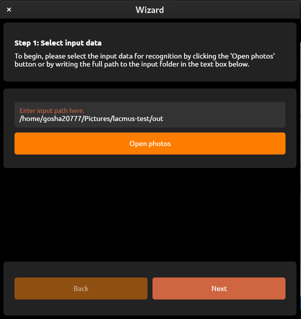

* _Далее_ - перейти к шагу 2.
* _Назад_ - вернуться к предыдущему шагу.

#### Шаг 2: Выбор папки для сохранения

На этом шаге пьзовлю предлагается выбрать папку для сохранения результатов.

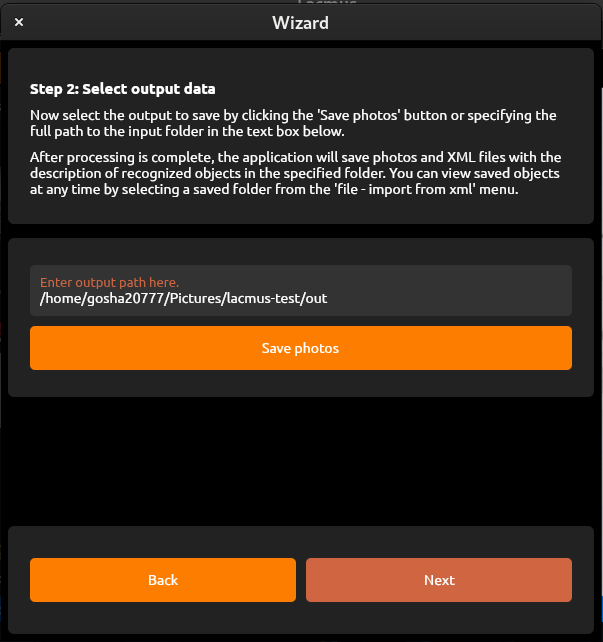

* _Далее_ - перейти к шагу 3.
* _Назад_ - вернуться к предыдущему шагу.

Шаг 3: Запуск распознования.

Перед запуском распознования пользователю выводится информация о выбраной модели раознования и о статусе выбранной модели. В случае если модель не сконфигкрирована, пользователь может сконфигуриовать ее, нажав на кнопку `открыть настройки`.

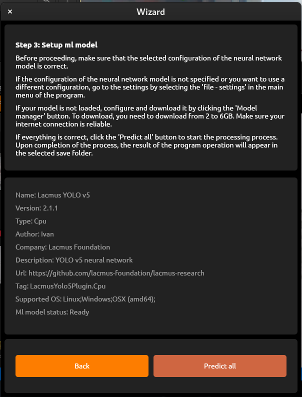

* _Обработать все_ - запустить распознавание.
* _Назад_ - вернуться к предыдущему шагу.

#### Процесс распознования

В этом окне отображается процесс распознованя изображений. Пользователь может отменить процесс, нажав на кнопку `стоп`.&#x20;

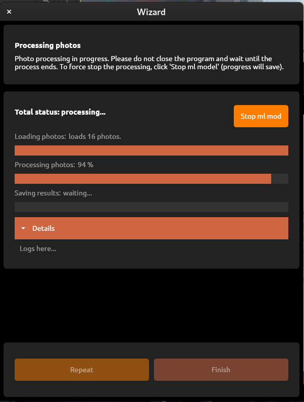

* _Повторить_ - вернуться к шагу 1.
* _Закрыть_ - выйти из помощника.

## Настройки


Настройки позволяют выполнить конфигурацию программы - настроить тему офформления, язык приложения, загрузить и установить ML модель.



* Для сохранения настроек нажмите кнопку _`Применить`_.
* Для возврата исходных настроек нажмите кнопку _`Отмена`_.



При изменении некоторых настроек может потребоваться **перезапуск приложения**. В таком случае над кнопкой _`применить`_ появится надпись - _`требуется перезапуск`_.


### Общие настройки

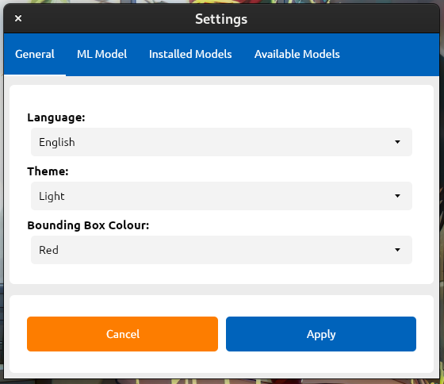

* _Язык_ - позволяет сменить язык программы. На выбор доступно два языка:
  * Русский
  * Английский
* _Тема_ - позволяет сменить тему офформления между _**темной**_ или _**светлой.**_
* _Цвет рамки_ - позволяет выбрать цвет рамки, которой обводится объект. на выбор датупны такие цвета:
  * _Красный_
  * _Зеленый_
  * _Синий_
  * _Берюзовый_
  * _Желтый_
  * _Пурпурный_

### ML Модель

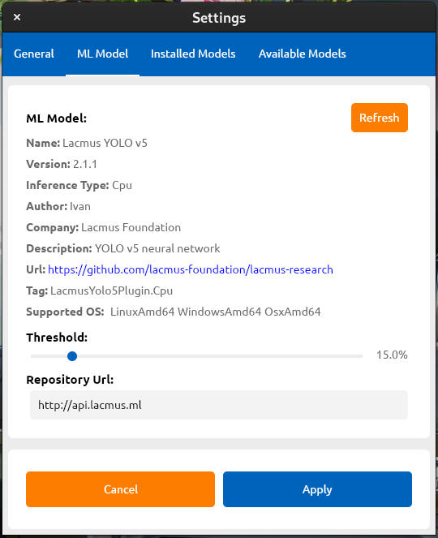

В данном окне выводится информация о выбранной модели:

* _ML модель_:
  * _Имя_ - название модели.
  * _Версия_ - версия модели.
  * _Тип выполнения_ - устройство на котором производятся вычисления (CPU, GPU, TPU и т.д.).
  * _Автор_ - автор модели.
  * _Компания_ - организация, поставляющая модель.
  * _Оисание_ - краткое описание модели.
  * _Url_ - ссылка на исходный код модели.
  * _Тег_ - уникальный тег модели.
  * _Поддерживаемые ОС_ - список поддерживаемых операционных систем.&#x20;
* _Пороговое значение (чувствительность)_ - величина в % характеризующая степень срабатывания модели. Чем **меньше** эта величина, тем **больше** объектов будет находить нейронная сеть (в том числе и ложных).


* Например если на изображении находится человек и артефакт (например бочка или мусор) то ML модель отметит человека с уверенностью в 40% а артефакт с увереностью в 20%. Если при этом пороговое значение стоит на отметке в 30% то артефакт будет проигнорирован. Если пороговое значение установить в 15% то будут отмечены оба объекта.
* От локации к локации эти показатели могут меняться. Таким образом у пользователя есть возможность провезди донастройку модели в случае большого колличества ложных сработываней. Или наоборот, если алгоритм ничего не нашел, имеет смысл понизить пороговое значение.
* Значение в 15% яаляется оптимальным.


* _Репозиторий_ - ссылка на репозиторий откуда будут скачиваться модели. \
  `api.lacmus.ml` - официальный репозиторий lacmus foundation. Но команда lacmus не запрещает настраивать и разворачивать собственные репозитории.
* _Обновить_ - обновить информацию о модели

### Установленные модели


В данном окне отображается спимок моделие установленных в систему.


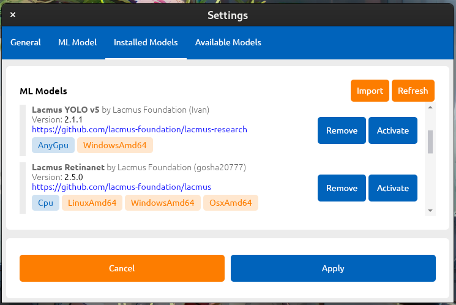


Каджый элемент содержит краткую итформацию о модели, ее типе, авторе, версии и т.д.


* _Удалить_ - удалить соответствующую модель.
* _Активировать_ - выбрать соответсвующую модель для распознования.
* _Импортировать_ - установить модель из файла (опция может быть полезна в условиях отсутсвия Интернета).
* _Обновить_ - обновить список моделей.

### Доступные модели


В данном окне отображается спимок моделей доступных для загрузки из репозитория.



* _Установить_ - установить соответствующую модель в систему.
* _Обновить_ - обновить список моделей.

## Параметры сохранения


Здесь пользователь может выбрать дополнительные опции сохранения результатов.


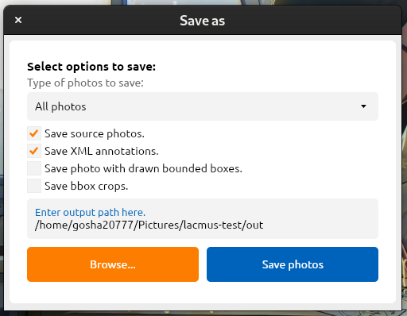

* _Тип сохраняемых фотографий_ - тип фотографий, которые нужно сохранить:
  * _Все фото._
  * _Фото с объектами._
  * _Избранные фото._
* _Сохранить исходные фотографии_ - копировать исходные фото в папку сохранения.
* _Сохранить XML аннотации_ - в папке сохранения добавятся XML файлы.
* _Сохранить фото с нарисованными обьектами_ - в папке сохранения добавятся фото с нарисованными рамками объектов.
* _Сохранить вырезанные объекты_ - в папке сохранения сохранятся вырезанные объекты.
* _Открыть..._ - выбрать папку для сохранения.
* _Сохранить_ - сохранить фотографии.

## Окно просмотра геопозиции


В этом окне пользователь может просмотреть геопозицию центра фотографии, а также получить информацию о метаданных изображения.


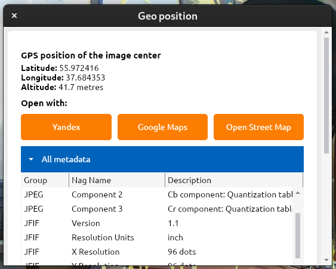

* QR код - ссылка на геопозицию (Open Street Maps)&#x20;
* Широта - широта в WGS84.
* Долгота - долгота в WGS84.
* Высота - высота над уровнем моря.
* Открыть с помошью:
  * Яндекс - открыть точку в Яндекс.Картах.
  * Google Maps - открыть точку в Google maps.
  * Open Street Maps - открыть в OSM.
* Методанные - таблица с методанными изображения.

## Отправка сообщения об ошибке


Тут пользователь может отправить сообщение об ошибке распознавания.



* Эти данные будут отправлены к нам на сервер, а затем промодерированы нами.
* Это позволяет улучшить качество распознования ML моделей.
* Также это позволяет пополнять наш [публичный набор данных](https://github.com/lacmus-foundation/ladd-and-weights).


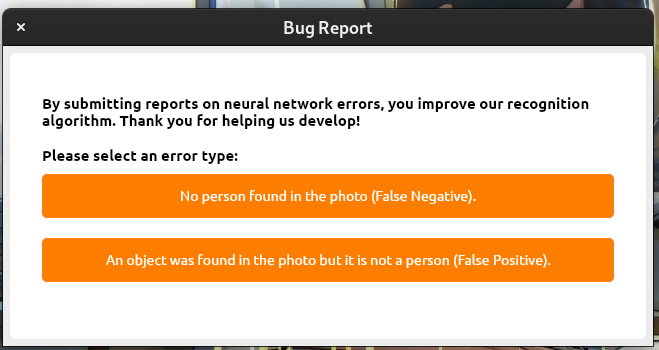

Пользователю предлагается выбрать тип ошибки

* Человек был пропущен на фото алгоритмом
* Алгоритм отметил неверный объект

## Информация о программе


Здесь можно просмотреть информацию о программе, ее версию, получить сведенья о лицензии.


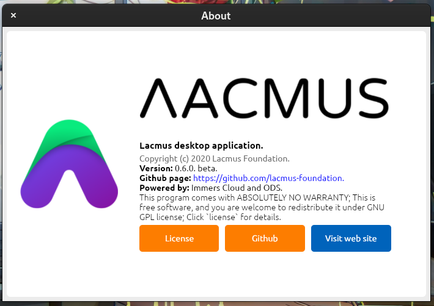

* Лицензия - просмотреть информацию о [лицензии](https://github.com/lacmus-foundation/lacmus-app/blob/master/LICENSE).
* GitHub - открыть [github страницу проекта](https://github.com/lacmus-foundation).
* Веб сайт - открыть [сайт проекта](https://lacmus-foundation.github.io/).

## Журнал событей (Лог)


* В лог попадают все события которые происходят в программе. Лог позволяет разработчикам легко отследить причину неисправности, а пользователи могут добыть оттуда полезную информацию.
* Лог также сохраняется в файл.


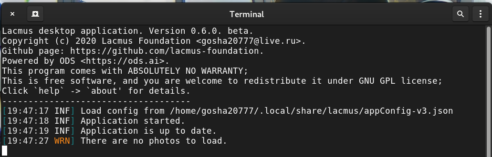
