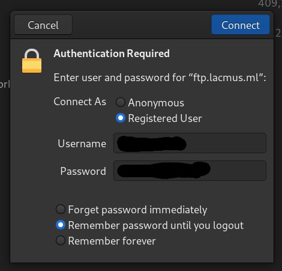
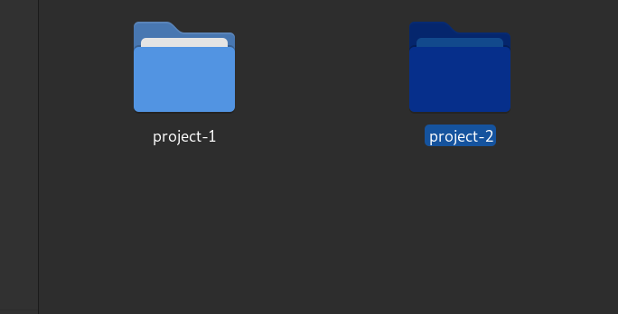
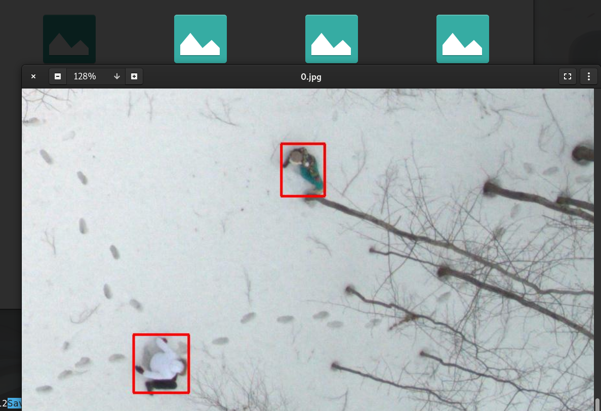

# 📔 Руководство Использования FTP


Помимо десктоп-приложения и обработки фотографий оффлайн команда Lacmus Foundation предлагает сервис для онлайн обработки фотографий. Так можно быстро обработать фотографии просто отправив их на сервер с помощью FTP.



Каждый пользователь имеет свое собственное защищенное хранилище. Lacmus Foundation не занимается сбором данных. Доступ к хранилищу имеет только пользователь и никто другой.


### Получение доступа к FTP

Для получения доступа к FTP необходимо создать учетнуб запись. Для этого напишите нам сообщение.

Написать можно любым возможным способом:

* В наш чат в Telegram: [https://t.me/found\_lacmus](https://t.me/found\_lacmus) (предпочтительный способ)
* Telegram нашим администраторам: @gosha20777 @Palladdiumm @Ivan\_po
* VK: https://vk.com/gosha20777
* E-mail: \<gosha20777@live.ru>

В сообщении представьтесь, кратко опишите зачем вам доступ к FTP

После рассмотрения вашей заявки - вам будут выданы

* Login
* Password
* Project-ID

### Использование FTP


Для взаимодействия с FTP могут использоваться любые FTP клиенты (например FileZilla, GNU FTP и т.д.).

В статье приведен пример использования клиента Gnome Nautilus&#x20;


* Войдите на FTP
  * Имя сервера - `ftp.lacmus.ml`
  * Порт - 21
  * Имя пользователя - `ваш login`
  * Пароль - `ваш password`



* Откройте папку вашего проекта с вашем Project-ID: `project-<Project-ID>`




Папка проекта имеет следующую структуру:

```
- /project-id-1:
	# Файлы для анализа
	- file1.jpg
	- file2.jpg
	- file3.jpg
	- /result:
		- /found:
			# Фото с объектами
			- file4.jpg
			- file5.jpg
			- file6.jpg
		- /empty:
			# Пустые фотографии
			- file9.jpg
	- /error:
		# Файлы которые не были обработаны по какой-либо причине
		- file10.jpg
		- file10.error.txt
	- /description:
		# Описание проекта ПСО
		- description.txt
```


* Скопируйте файлы фотографий в **корень** папки вашего проекта `/project-<Project-ID>`


* В папке `result` появятся результаты обработки:
  1. Пустые фотографии будут находиться в папке `result/empty`
  2. Фотографии с объектами будут находиться в папке `result/found`




Обработка может занять некоторое время.

В процессе работы файлы из корневой директории будут удалены и перемещены в папку `result/*/`. На файлах с объектами, люди будут отмечены красной рамкой.



Для удаления файлов и очищения хранилища - создайте в **корневой** директории проекта файл с именем `command-clear.txt` (или скопируйте имеющийся файл).&#x20;

Ваше хранилице будет очищено.



Web сервис онлайн обработки изображений использует **остаточные мошьности** сервера Lacmus Foundation. Это значит, что время обработки может увеличиться, если команда Lacmus Foundation выполняет на сервере какие-либо рассчеты.

