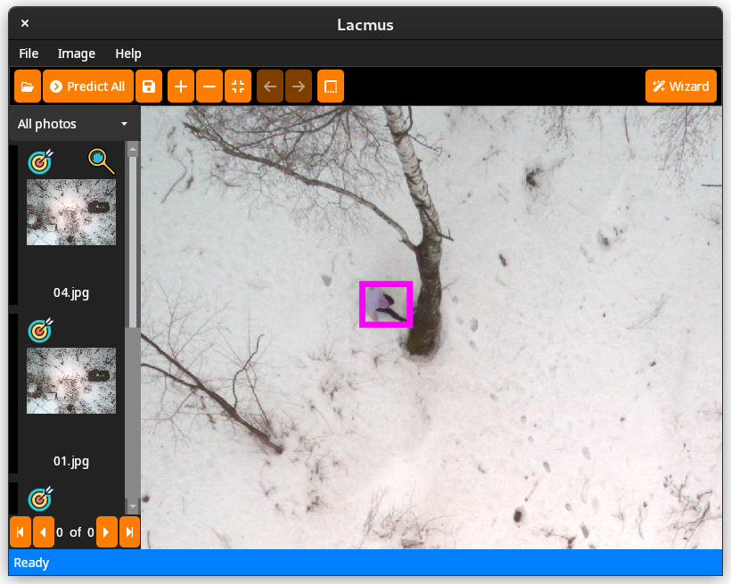
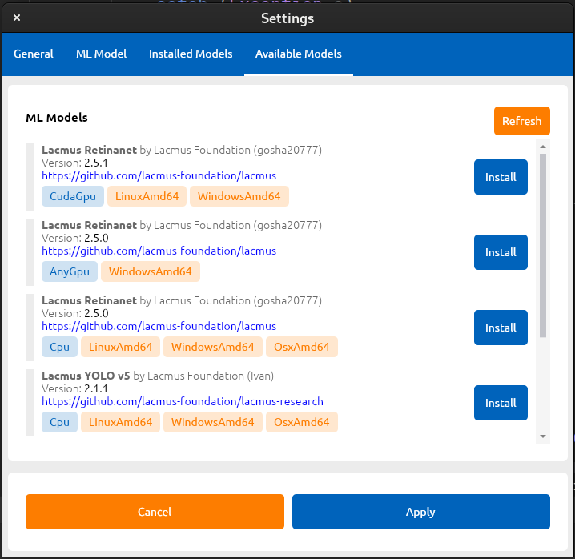
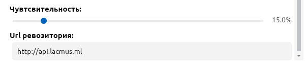

# 👾 Приложение

### 0.7.0 - Penetrating Diffusion

* Обновлен интерфейс\

<figure><figcaption>
Интерфейс
</figcaption></figure>

* Добавлены горячие клавиши
* Произведен рефакторинг кода
* Обновлен фреймверк отрисовки AvaloniaUI `0.10.6` -> `0.10.1`
* Добавлены иконки кнопок
* Добавлена возможность изменения цвета рамок объектов
* Добавлен QR код в окно геопозиции, возволяющий открыть гопозицию на карте
* Обновлены установшики программы
* Исправлено множество багов, повышена стабильность работы программы



### 0.6.0 - Incredible Oxidation

* Обновлен фреймверк отрисовки AvaloniaUI `0.10.3` -> `0.10.6`
* Исправлена ошибка, когда рамки объектов не отображалить на Canvas
* Переработан интерфейс настроек и менеджера моделей
* Добавлена возможность установки моделей без интернета
* Для импорта из XML теперь используются относительные пути
* Добавлены новые настройки чевтвительности и репозитория в меню настроек\
  &#x20;
* Изменена модель по умолчанию **Lacmus Retina Net** -> **Lacmus YOLO v5**
* Изменен способ инициализации компонентов на `WhenActivated(...)`
* Часть проекта переведена на паттерн ReactiveUI + MVVM
* Произведен рефакторинг кода
* Исправлено множество багов, повышена стабильность работы программы


Download link

