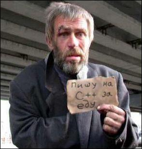

# ❤ Помощь Проекту

## Лучший спомоб помочь нам - это сделать что-то для наc.


Проект Lacmus Foundation не имеет представительств, юредических лиц, банковских и иных денежных счетов. Вся наша ассоциация полностью свободна, открыта, интернациональна и существует на свободных и добровальных началах. Мы не принимаем денег, и не ведем никакую финансовую дейтельность.


## Пути помощи проекту

* Вы можете рассказать о нас друзьям, знакомым, коллегам или в своем ПСО.
* Вы можете поучавствовать в сборе данных, улучшив наш алгоритм распознования.
* Если вы разработчик программного обеспечения - вы можете принять участие в разработке нашего Open Seorce ПО, примкнув к нашей команде.
* Если вы журналист - вы можете написать о нас статью в СМИ, или снять о нас видео-репортаж.
* Если у вас есть идея по улучшению проекта вы также можете предложить нам ее.
* Вы можете помочь нам с написанием этой документации и переводом ее на другие языки.
* Вы можете купить пива любому нашему разработчику :beer: :-)
* Вы также можете выпить пиво в нашу честь, вступить в наш чат и наблюдать за развитием проекта!

### Котнакты для связи

* **Общий Telegram чат проекта:** [https://t.me/found\_lacmus](https://t.me/found\_lacmus)
* **Telegram:** @gosha20777, @Ivan\_po, @Palladdiumm  - модераторы, активные участники проекта.
* **Email:** gosha20777@live.ru
