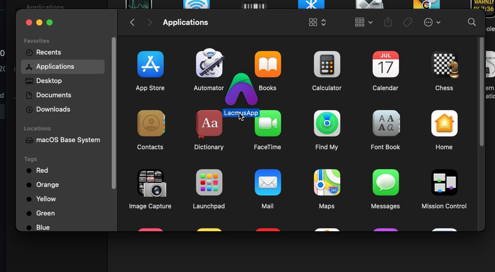
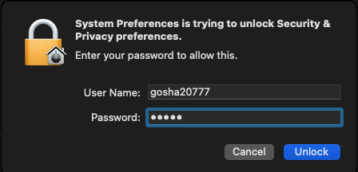
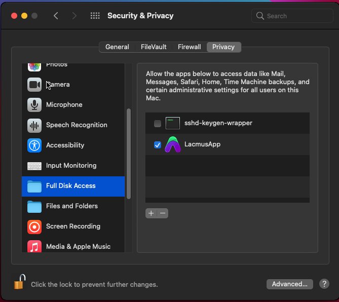
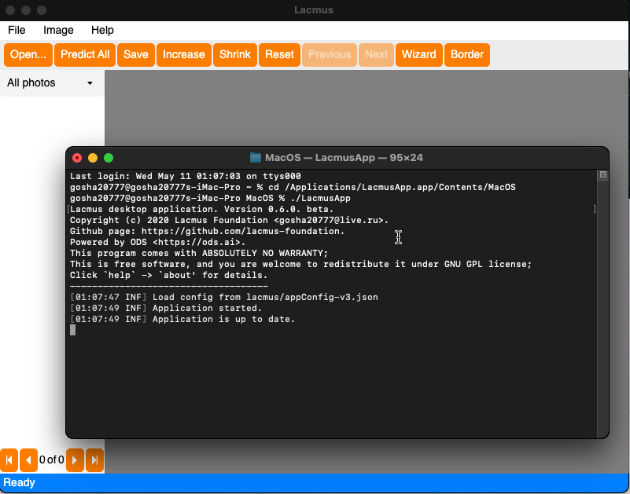

# ❓ Questions and Answers

## How to Run Lacmus on OSX?&#x20;


Unfortunately, Apple does not allow to develop programs without an Apple ID account and computers with MacOS. In fact, our developers do not have Apple computers, which complicates the development. That's why running the program is quite difficult.

We hope that the situation will improve and the Lacmus App will be available in the Apple Store.

Bellow we say how to bypass Apple restrictions.


#### Install and configure OS

1. [Download](https://github.com/lacmus-foundation/lacmus-app/releases) the latest Lacmus Application release.
   1. Choose the latest release.
   2. Download `lacmus_X.X.X_osx_amd64.tar.xz` archive, where **X.X.X** - is a version number.
2. Extract the archive (by clicking 2 times).
3. Drag an extracted app to the **Application** folder.\
   
4. Try to open the Lacmus App. Your Mac will show the security alert. Ignore this.
5. Open the **System Preferences** -> **Security & Safety**.
6. Go to **General** tab.
7. Click on the padlock at the bottom of the window and enter our password.
8. Allow to run Lacmus Application.
9. Go to **Privacy** tab.
10. Select **Full Disk Acsess** and drag the Lacmus Application here.
11. Save and close the settings.

#### Run the App

* Open terminal and enter the commands bellow:

```
$ cd /Applications/LacmusApp.app/Contents/MacOS
$ ./LacmusApp
```


