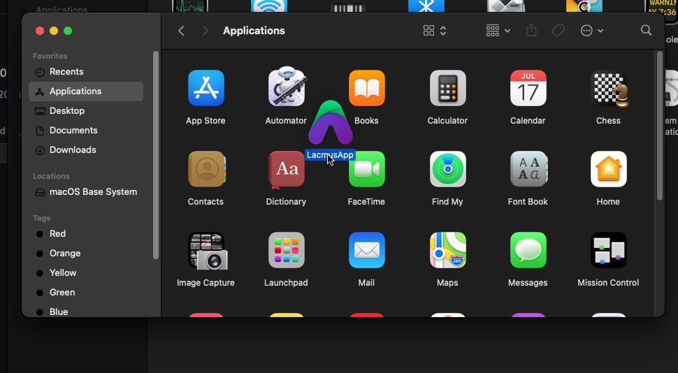
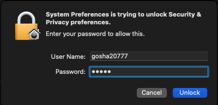
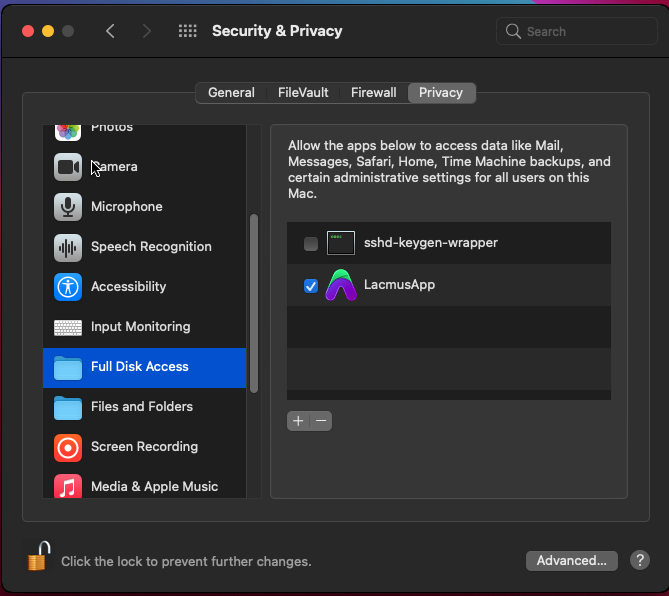

# ❓ Вопросы и Ответы

## Где скачать приложение?

Скачать приложение можно по [ссылке](https://github.com/lacmus-foundation/lacmus-app/releases).

## Какую ML модель выбрать?

Об этом подробно написано [тут](../app/system-requirements/model-zoo.md).

Также мы нарисовали схему, которая может помочь:


## Как запустить на OSX?


Запуск под OSX осложнен тем, что компания Apple не позволяет разработывать приложения без учетной записи Apple и компьютеров с MacOS. Наши разработчики не имеют компьютеров от Apple, что усложняет разработку приложения.

Ниже приведна инструкция как обойти ограничения Apple.


#### Настройка системы

1. [Скачайте](https://github.com/lacmus-foundation/lacmus-app/releases) приложение.
   1. Выберите последний релиз.
   2. Скачайте файл `lacmus_X.X.X_osx_amd64.tar.xz`, где **X.X.X** - версия программы.
2. Распакуйте архив (кликнув по нему 2 раза).
3. Перетащите приложения в папку с приложениями.\
   
4. Запустите приложение (кликнув по нему 2 раза). MacOS сообщит что приложение от недоверенного разработчика.&#x20;
5. Откройте настройки системы -> безопасность.
6. Перейдите во вкладку общее (general).
7. Назмите на замочек внизу окна и введите пароль.\
   
8. Разрешите запуск притожения Lacmus.
9. Перейдите во вкладку безопасность (privacy).
10. Перейдите в пункт Полный доступ к диску.
11. Переращите приложение Lacmus в окно.\
    
12. Сохраните настройки.

#### Запуск приложения

* Откройте терминал
* Введите команды

```
$ cd /Applications/LacmusApp.app/Contents/MacOS
$ ./LacmusApp
```


